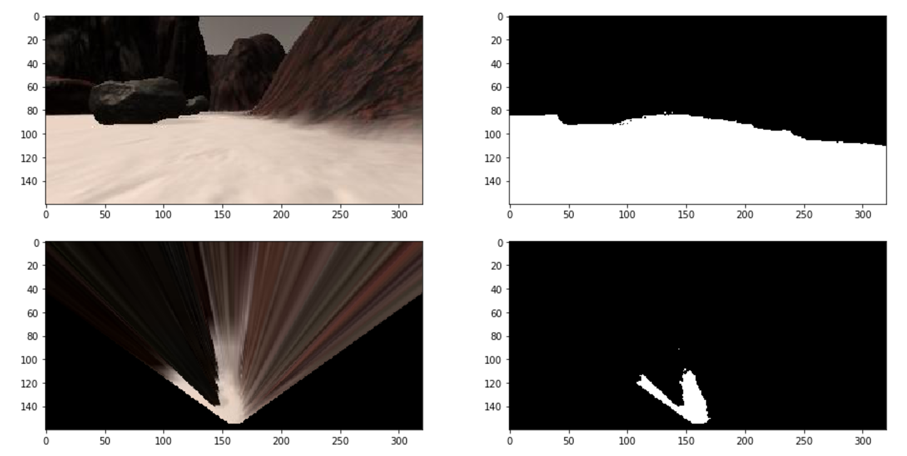
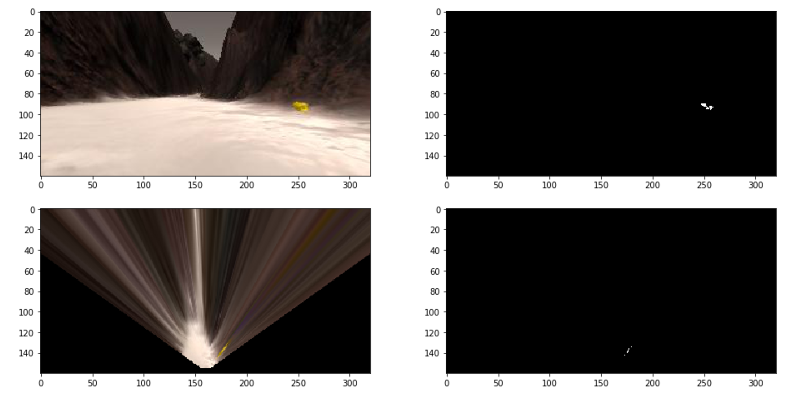
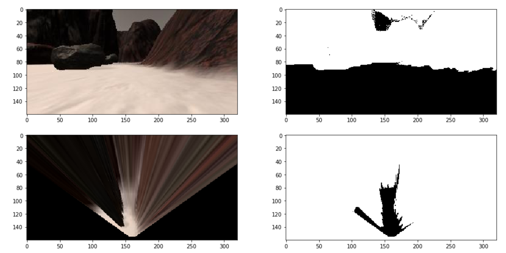

# Project: Search and Sample Return

## Notebook Analysis
### Color Selection of Obstacles and Rock Samples

I implemented a simple color thresholding function using the OpenCV function `inRange`:

```
def color_threshold(img, min, max):
    return cv2.inRange(img, min, max)
```
 
With this thresholding function, I implemented functions for navigatable terrain, rocs and obstacles:

```
def detect_nav(img):
    return color_threshold(img, (160,160,160), (255,255,255))
    
def detect_rock(img):
    return color_threshold(img, (150,140, 0), (255,255,32))
    
def detect_obs(img):
    return color_threshold(img, (0,0,0), (116,116,116))

```

These are the results:

*(a) Navigatable Terrain*


*(b) Rock Sample*


*(c) Obstacles*



### Map Generation
The center piece of my implementation of the `process_image` function is the following function which processes on layer (nav, rock, obs). It applies color threshols, transforms to rover coords and imposes a range limit in order to increase map fidelity. Finally, it transforms the image into the world coordinate system.

```
def process_layer(warped_img, min, max):
    mask = color_threshold(warped_img, min, max)
    xpix,ypix = rover_coords(mask)

    # Impose a range to the pixels in order improve map accuracy
    xpix,ypix = impose_range(xpix,ypix,range=50)
    x,y,yaw = data.xpos[data.count], data.ypos[data.count], data.yaw[data.count]
    yaw = np.pi * yaw / 180.0
    worldsize = 200 #data.worldmap.shape[0]
    scale = 0.1
    return pix_to_world(xpix, ypix, x, y, yaw, worldsize, scale)
```

In the `process_image` function I call the `process_layer` function with the respective color threshold values to generate masks for navigatable terrain, rock and obstacles. I only add these to the world map if the roll and pitch angles of the rover are below certain thresholds. I have included the resulting video in the submission.


## Autonomous Navigation and Mapping

### Perception Step
In the perception step I process the camera image of the rover in the following way: I first take the color thresholds for the navigatable terrain, obstacle and rock masks. The resulting masks are then warped by the perspective transform step. In order to increase the fidelity of the map I limit the range of the masks that will be added to the map. As the distortion of the masks and the influence of pitch/roll of the rover greatly increased with distance, only the closer pixels are added. For the course computation, rock detection and obstacle avoidance the whole range of the masks is used.

The constructed masks are then transformed from the rover coordinate system to the world coordinates and added to the map. This step is only performed when the pitch and roll angles are below empirical thresholds.
In a last step the masks are converted into polar coordinates which are used to compute the bearings of navigatable terrain, obstacles and rock samples.


### Decision Step

The robot is programmed as a simple crawler. Like an insect it reacts to basic cues in the environment and reacts with predetermined behavior patterns. The basic strategy is to always follow the wall on the left side of the rover. As in a maze, this will allow the rover to visit all of the map with in a single run (if everything works according to plan).

I realized early on that this behavior is still of non-trivial complexity because we need to add obstacle evasion and breaking free manoevers, among others. Implementing this as a giant `if` clause as proposed in the project would not be feasable. I therefor decided to implement an object based state machine instead.

The center of this system is the class `StateMachine` which manages a stack of currently active states or actions. The states are implemented as objects that implement a `run` method for actuating the rover and a `next` method that determines the next state. `next` can either return `self` for keeping the state alive, return `None` if has ended or return a new state that will be executed as a subtask.

I then implemented basic actions like `MoveDistance`, `Rotate`, `Stop` or `TurnToBearing`, among others. These basic actions can be combined into more complex behaviors with the use of the `StateQueue` class, which will perform a chain of actions. An example is shown below: 

```
class FindAndPickupRock(StateQueue):
    def __init__(self, rover):
        super().__init__(rover)
        bearing = bearing_to_rock_deg(self.rover)
        self.add(Stop(self.rover))
        self.add(TurnToBearing(self.rover, bearing))
        self.add(ApproachRock(self.rover))
        self.add(Stop(self.rover))
        self.add(PickupRock(self.rover))
        if bearing < -5:
            self.add(ReturnToPosAndHeading(self.rover, self.rover.pos, self.rover.yaw))
        else:
            self.add(TurnToHeading(self.rover,self.rover.yaw))
```

This behavior is executed when the rover percieves a nearby rock. It first stops and turns toward the bearing of the rock. Then the state `ApproachRock` is executed which itself is a combination of different actions. Once the rock has been reached and picked up, the rover is instructed to return to the initial position and heading in order not to disturb the map crawling pattern.

Most of these states are transitory and are removed as soon as they have finished. But there are two states that are the parent states for these other ones: `MapAndCollect` and `ReturnHome`. These are added to the `StateQueue` at the beginning of the simulation. `MapAndCollect` will move the rover foreward on the left edge of the navigatable terrain, while also avoiding obstacles and picking up rocks. It will remain the active parent state until all of the rock samples have been collected. 

After `MapAndCollect` has ended, the state `ReturnHome` will direct the rover to its initial position on the map. It will try to follow the bearing to the home position which is constrained by the angles of the navigatable terrain and obstacles. This simple heuristic is enough to reach the home position because of the simple topology of the map. In the general case, a path planning algorithm based on the constructed map would be required.


### Autonomous Navigation and Sample Return
A successful completion of the sample return challenge can be seen in this video: https://www.youtube.com/watch?v=gXmHa9ratmc

In this run the rover managed to map 94.9% of the map with 78.3% fidelity. It collected all six rocks and returned to the initial position after 855 seconds. 

There are a number of ways the implementation could be improved:

- The perception step could be further optimized by making use of different color spaces like HSV. I stayed with RGB because it was good enough, but the rover sometimes had difficulties to distinguish the edges of the navigatable terrain.
- A PID controller could be used to control the target velocity instead of the simple mechanism employed.
- The planning of trajectory for map crawling could be implemented by using the constructed map. A polynomial could be fitted against the edge of the drivable terrain which could then be followd by a PID controller.
- The different behaviors could be futher improved, taking into account more cues of the environment. This would prevent the rover from blindly following a predetermined action that could lead to an unfavourable state.
- The state machine could be further improved to allow for the cancellation of complex behaviors if something unforseen happens.
- Keep track of the last visited positions on the map in order to change the behavior should the rover get stuck between rocks or drive in circles.
- The return step should incorporate the knowledge gained by constructing the map and use path planning which could also navigate arouned mapped obstacles.


